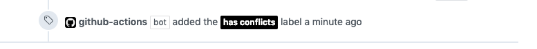

# auto-label-merge-conflicts
> A Github action to auto-label PRs with merge conflicts

## Purpose

This action checks all open Pull Requests for merge conflicts and marks them with a Github label. 



Once a conflict is resolved the label is automatically removed.

The typical use case is to run this action post merge (e.g. push to `master`) to quickly see which other PRs are now in conflict.
 
We use this setup e.g. on our monorepo at [Comtravo](https://github.com/comtravo). Instead of a grumpy CTO pinging developers to fix their merge conflicts there's now a shiny bot.

## Set up

To configure the action on your repo you have to do 2 things:

1) pick a Github label that should be used to mark PRs with conflicts

This label will then be managed by this action. It will be added to PRs with merge conflicts and removed from PRs without conflicts.
 
2) configure the new workflow by creating a YML config file in your `.github/workflows` folder:

```
on:
  push:
    branches:
      - master
jobs:
  triage:
    runs-on: ubuntu-latest
    steps:
      - uses: mschilde/auto-label-merge-conflicts@master
        with:
          CONFLICT_LABEL_NAME: "has conflicts"
          GITHUB_TOKEN: ${{ secrets.GITHUB_TOKEN }}
```

The label from step 1 should be referenced in the parameter `CONFLICT_LABEL_NAME`

Take a look at [this repo](https://github.com/mschilde/auto-label-merge-conflicts/blob/master/%2Egithub/workflows/label_merge_conflicts.yml) for an example setup.

## Limitations

Github does not reliably compute the `mergeable` status which is used by this action to detect merge conflicts. 

If `master` changes the mergeable status is unknown until someone (most likely this action) requests it. [Github then tries to compute the status with an async job.](https://stackoverflow.com/a/30620973) 

This is usually quick and simple, but there are no guarantees and Github might have issues.

## Local dev setup

To play around with the code base, you need `Docker` and `make` set up locally.

Run `make build`, `make develop`, then `yarn install`.
